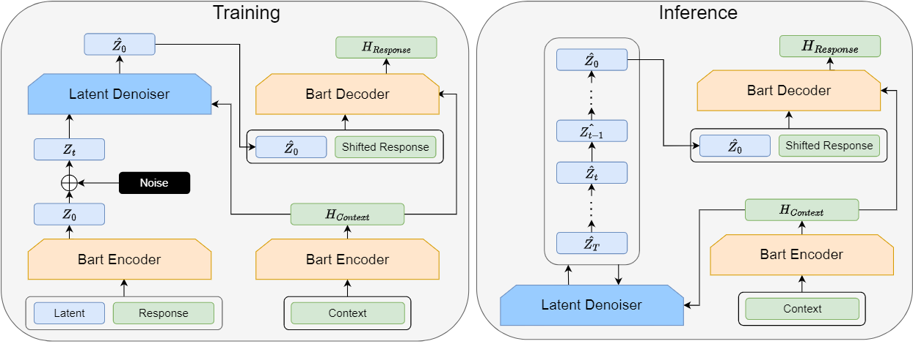

# DiffusionDialog: A Diffusion Model for Diverse Dialog Generation with Latent Space

## Abstract

In real-life conversations, the content is diverse, and there exists the one-to-many problem that requires diverse generation. Previous studies attempted to introduce discrete or Gaussian-based continuous latent variables to address the one-to-many problem, but the diversity is limited. Recently, diffusion models have made breakthroughs in computer vision, and some attempts have been made in natural language processing. In this paper, we propose DiffusionDialog, a novel approach to enhance the diversity of dialogue generation with the help of diffusion model. In our approach, we introduce continuous latent variables into the diffusion model. The problem of using latent variables in the dialog task is how to build both an effective prior of the latent space and an inferring process to obtain the proper latent given the context. By combining the encoder and latent-based diffusion model, we encode the response's latent representation in a continuous space as the prior, instead of fixed Gaussian distribution or simply discrete ones. We then infer the latent by denoising step by step with the diffusion model. The experimental results show that our model greatly enhances the diversity of dialog responses while maintaining coherence. Furthermore, in further analysis, we find that our diffusion model achieves high inference efficiency, which is the main challenge of applying diffusion models in natural language processing.

## Model Architecture



Architecture of DiffusionDialog.

## Depenedency

### Download packages

```bash
pip install -r requirements.txt
```


## Train & Evaluate
This project includes the training and evaluation code of our proposed method:DiffusionDialog, as well as the baseline model:Bart Base. These codes are executed through shell scripts and are stored in the "scripts" folder. Each file is named as (dataset name)_(model name), and contains the training and evaluation code for the respective model on the corresponding dataset. Here is the explaination of important variable and instruction of how to run the code:

### Important variable
```data_root```: the root directory of our dataset. \
```proj_dir```: the root directory of our project. \
```sent_stage_[training, evaluation, test]```: the control symbol of training or eval. \
```--plm_init_path```: the location of the base model: Bart_base, on the server. \
```--tokenizer_path```: the location of the tokenizer of bert-base-uncased. \
```--checkponit_path```: the location of the checkpoint directory after the training. \
```--save_result_dir```: just the same as ```--checkponit_path```

### How to run
Taking training the DiffusionDialog model on the Dailydialog dataset and evaluating the training results as an example.
#### Train
Firstly, set ```sent_stage_training=1, sent_stage_evaluation=0, sent_stage_test=0```

then run the script:
```bash
bash daily_diffusiondialog.sh
```
Running this code will train a DiffusionDialog model and create a directory in the "log" folder that contains checkpoints for various training checkpoints. These checkpoints can be used for evaluation.

#### Evaluation
Firstly, set ```sent_stage_training=0, sent_stage_evaluation=1, sent_stage_test=0```

Then set the ```--checkpoint``` variable to the address of the directory obtained from the training and run the script:

```bash
bash daily_diffusiondialog.sh
```